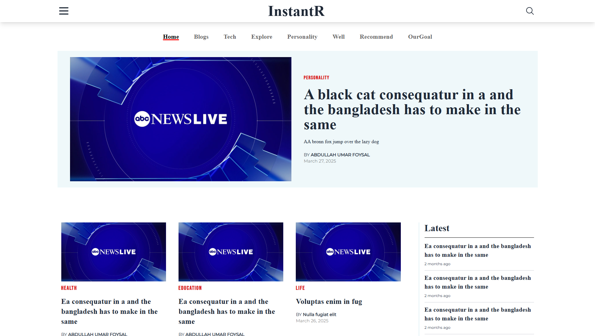

# 📰 Instant News Portal

**Live Site:** [https://instant-r.web.app/](https://instant-r.web.app/)

Instant News Portal is a fully responsive and dynamic news publishing platform where users can read the latest news, search by category, and view video content. The application includes a powerful role-based dashboard system that supports admin approval workflows and secure content management.

---

## Login & test
**Admin email & pass**
- Email: admin@gmail.com
- Pass: admin123
**Moderator email & pass**
- Email: moderator@gmail.com
- Pass: moderator123
**Editor email & pass**
- Email: editor@gmail.com
- Pass: editor123

## 📸 Screenshots

Here are some previews of the project interface:

### 🏠 Home Page



### 🔐 Dashboard - Admin View


---

## 🚀 Features

- 🔍 **News Search**: Search news by category, title, or description.
- 🗂️ **Category-wise Browsing**: Explore news filtered by category.
- 📽️ **Video Gallery**: Watch video-based news from a dedicated section.
- 📱 **Fully Responsive**: Optimized for mobile, tablet, and desktop.
- 👥 **Role-Based Dashboard**:
  - **Admin**: Full control—approve/reject posts, assign roles, manage users.
  - **Moderator**: Create, edit, and delete own posts (with admin approval).
  - **Editor**: Create and edit own posts (approval required).
- ✅ **Approval System**: All posts/edits by moderators and editors go through admin approval with rejection reason logging.
- 🔒 **Secure Onboarding**: New users must be approved and assigned a role by an admin before accessing dashboard features.
- 🧑‍💻 **Profile Management**: Users can set their name and profile picture after approval.

---

## 🛠️ Technologies Used

### 🔧 Frontend:
- **React** (v18)
- **Vite**
- **Tailwind CSS**
- **DaisyUI**
- **React Router DOM**
- **React Hook Form**
- **React Icons**
- **React Quill & Jodit Editor** – for rich text content editing
- **React Slick & Slick Carousel** – for sliders and carousels
- **SweetAlert2** – for beautiful alert modals
- **AOS (Animate on Scroll)** – for scroll animations
- **Tailwind Scrollbar Hide** – for cleaner UI

### 🔐 Authentication & Backend:
- **Firebase Auth**
- **Firebase Firestore** – (assumed as part of `firebase` usage)

### 🌐 API & Utilities:
- **Axios** – for HTTP requests
- **React Query** – for data fetching and caching
- **DOMPurify** – for safe rendering of HTML
- **Date-fns** – for formatting and manipulating dates

---

## 📦 Installation & Setup

```bash
# Clone the repo
git clone https://github.com/shahalimshompod/Instant-news-portal.git

# Navigate into the project
cd instant-news-portal

# Install dependencies
npm install

# Run in development mode
npm run dev
